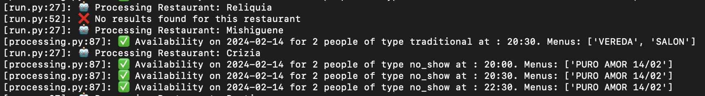

# restaurant-availability

#### Configuration files

The project contains environment configuration for database credentials, and overall execution setting. Just create a `.env` file within /availability-finder with necessary environment variables, which are:

##### SEARCH QUERY PARAMS IN ENVIRONMENT VARIABLES
    - MAX_DATE=2024-02-14
    - MIN_DATE=2024-02-14
    - DINNER_HOUR_MAX=23
    - DINNER_HOUR_MIN=20
    - LUNCH_HOUR_MAX=14
    - LUNCH_HOUR_MIN=12
    - NUM_PEOPLE=2
    - SLEEP_TIME_IN_SEC=60
    - CATEGORIA=GENERAL

#### En settings pueden ver el mapa de categorias y listado de restaurants dentro
```python
busqueda = {
    ('SUSHI'): restaurants_sushi,
    ('PLATITOS'): restaurants_platitos,
    ('GENERAL'): restaurants_general
}
```
#### Resultado de la búsqueda, Disponibilidad, Turno y Opciones de reserva


## Process to execute

#### 1. Open Command Prompt and CD into cloned directory

#### 2. (WINDOWS) Create .env file with necessary parameters
```shell
echo. > .env
```
```shell
notepad .env
```

#### 3. (WINDOWS) Add necessary parameters and save file

#### 4. Build image if not done already
```shell
docker-compose build
```

#### 5. DEFAULT: Run services all-in-one
```shell
docker-compose run restaurant-availability-detection
```

## License

Copyright 2024

Licensed under the Apache License, Version 2.0 (the "License");
you may not use this file except in compliance with the License.
You may obtain a copy of the License at

http://www.apache.org/licenses/LICENSE-2.0

Unless required by applicable law or agreed to in writing, software
distributed under the License is distributed on an "AS IS" BASIS,
WITHOUT WARRANTIES OR CONDITIONS OF ANY KIND, either express or implied.
See the License for the specific language governing permissions and
limitations under the License.